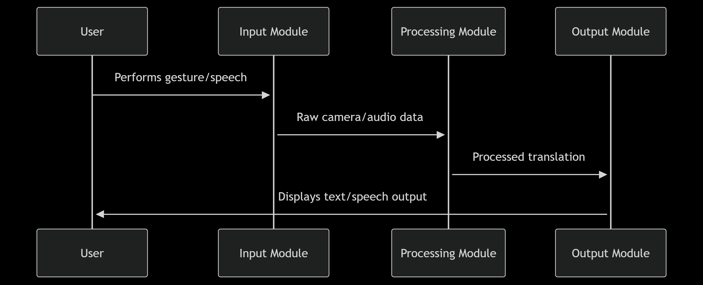

# 📝 LOG BOOK  
**Real-Time Sign Language Translator App**  
**Semester Project - III (Sem-V, 2024-25)**  

---

## 📅 Weekly Progress  

| Week | Date Range | Tasks Completed | Next Steps |
|------|------------|------------------|-------------|
| 1 | 19/8/24 - 24/8/24 | **Introduction**: Background, Motivation | Finalize problem statement |
| 2 | 26/8/24 - 31/8/24 | **Introduction**: Problem Statement, Objectives | Literature survey planning |
| 3 | 2/9/24 - 7/9/24 | **Literature Survey**: Reviewed existing systems, limitations | Tabulate findings |
| 4 | 9/9/24 - 21/9/24 | **Proposed System**: Architecture, Algorithm design | Finalize technology stack |
| 5 | 23/9/24 - 28/9/24 | **Requirements**: Software (Kotlin, TensorFlow Lite), Hardware (Android devices) | Begin UI prototyping |
| 6 | 30/9/24 - 5/10/24 | **Methodology**: Workflow design, dataset selection | Start UI implementation |
| 7 | 7/10/24 - 12/10/24 | **Module 1**: UI Prototype (Figma) → Android Studio conversion | Integrate ASL dataset |
| 8 | 14/10/24 - 19/10/24 | **Module 2**: Gesture recognition (TensorFlow Lite model training) | Speech-to-text API integration |
| 9 | 21/10/24 - 26/10/24 | **Module 3**: Backend logic, output synchronization | Testing & optimization |
| 10 | 28/10/24 - 2/11/24 | **Outcome**: Final testing, report writing, deployment prep | Cross-device checks |

---

## 📖 Detailed Chapters  

### Chapter 1: Introduction  
#### 1.1 Background & Motivation  
- Communication barriers between sign language users and non-users.  
- Need for automated, real-time translation tools.  

#### 1.2 Problem Statement  
- Lack of scalable, multilingual, and offline-capable solutions.  

#### 1.3 Objectives  
- Real-time sign ↔ text/speech translation.  
- Support for ASL, BSL, and Indian Sign Language.  

---

### Chapter 2: Literature Survey  
#### 2.1 Existing Systems  
| Method | Pros | Cons |  
|--------|------|------|  
| Human Interpreters | Accurate | Costly, scarce |  
| Glove-Based Systems | Precise | Non-scalable |  
| Computer Vision (MediaPipe) | Real-time | Requires optimization |  

#### 2.2 Research Gaps  
- Limited multilingual support.  
- Absence of video call integration.  

---

### Chapter 3: Proposed System  
#### 3.1 Architecture  
1. **Input Module**: Camera (gestures), microphone (speech).  
2. **Processing Module**: TensorFlow Lite (gestures), Google Speech API (voice).  
3. **Output Module**: Unified text display.  

#### 3.2 Technology Stack  
- **Frontend**: Kotlin (Android Studio).  
- **ML**: TensorFlow Lite, MediaPipe.  
- **Backend**: Firebase.  
##### 3.2.1 Core Technologies

    
#### 3.3 Cross-Module Integration
##### 3.3.1 Data Flow

    
---

### Chapter 4: Implementation  
#### 4.1 Phase 1 (Completed)  
- UI Prototype (Figma) → Screens: Home, Camera, Settings.  

#### 4.2 Phase 2 (In Progress)  
- Dataset integration (ASL from Kaggle).  
- Speech-to-text API testing.  

#### 4.3 Phase 3 (Upcoming)  
- Unit testing, performance optimization.  

---

## 🔧 Software & Hardware Requirements  
- **Software**: Android Studio, TensorFlow Lite, Firebase.  
- **Hardware**: Android smartphone (min. 4GB RAM).  

---

## ✅ Outcomes & Deliverables  
- Functional app with real-time translation.  
- Support for 3 sign languages (ASL, BSL, ISL).  
- Offline mode for low-connectivity areas.  

---

## 📚 References  
1. MediaPipe Documentation.  
2. "Sign Language Recognition with CNNs" – IEEE Paper.  
3. TensorFlow Lite for Mobile ML.  

